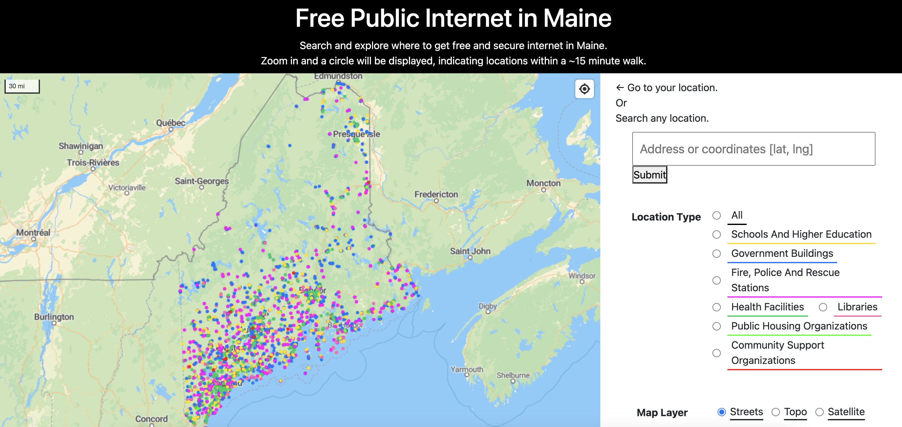

# CAI Search Website

This website is a display of locations in Maine with free public internet. The concept is to decrease the digital divide by offering free internet to those who cannot afford it or have the ability to purchase a subscription for various reasons. 

[Go to the CAI search website!](https://jinger12.github.io/CAI-Search-Website/CAI_search.html)

This project is a continuation of the work I did for the Maine Connectivity Authority. I created an updated database with every location in Maine that qualifies as a Community Anchor Institution (a place with free public internet). The page provides a service to search and explore locations where free and secure internet is available within the state of Maine. Users can zoom in on a map, which will then display circles indicating locations that are within approximately a 15-minute walk.

The user interface consists of a navigation bar at the top with the option to "Go to your location" or to search any location by entering an address or coordinates in a search box and then submitting the query. There are also options to filter the search by "Location Type" with a radio button to select among schools and higher education, government buildings, fire, police and rescue stations, health facilities, libraries, public housing organizations, and community support organizations.

On the right side of the interface, there's a panel with a map layer toggle that allows the user to switch between "Streets," "Topo," and "Satellite" views of the map. 

The map was made in Observable notebooks using D3 and other built-in Observable functions and features. Feel free to explore the code bellow.

[observablehq notebook URL](https://observablehq.com/d/f5268ba5aa8f6eee)
